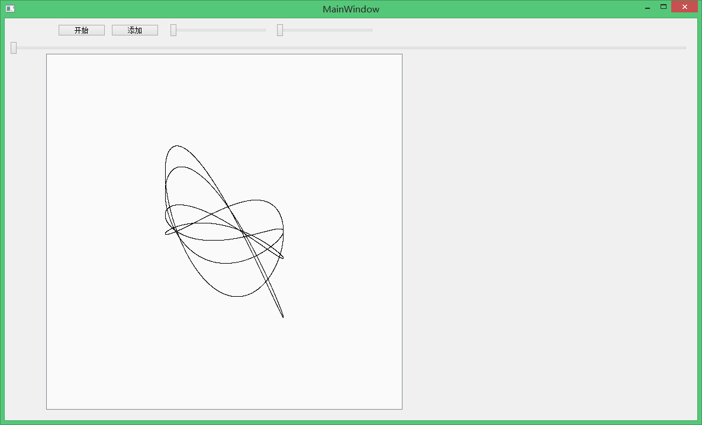

# LissajousAndChord

选择音阶的组合，程序通过参数方程绘制2D李萨如图形。

# 环境

使用Qt Creator 4.6.1 with Qt4开发。编译器使用安装Qt4时附带的mingw-GCC 4.4.0。

# 运行

占用CPU大约15%（i5-5200U）。

# 使用

gun.cpp的第17行决定使用十二平均律/五度相生率/纯律。

gun.cpp的第53行的公式决定x轴和y轴的波形。

# 窥视

如图x轴为C，y轴为CEG，纯律。

# 计划

可在界面选择x轴，y轴的音。或是做成3D的李萨如图形。

# 勘误

440Hz的基准音是A不是C。
